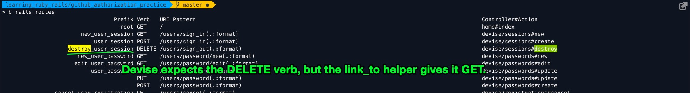
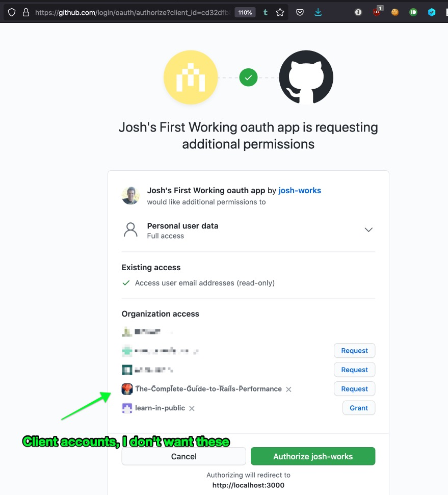
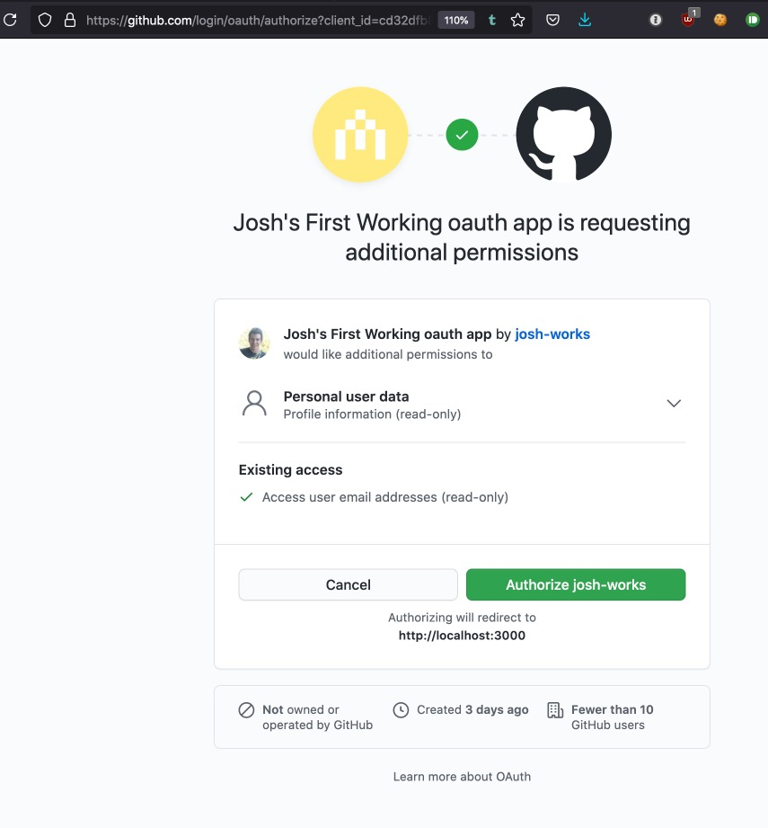

# Zero to MVP with Omniauth-Github

I want to have an app deployed on Heroku where one can log in via Github.

It'll live live somewhere, as proof.

Working through [https://github.com/josh-works/devise_practice_02](https://github.com/josh-works/devise_practice_02), where I finally (for like the third time) found a good guide to setting up Devise and authentication via Github.

# The Steps

I'm going to "narrarate" every step of this repositoiry, and the linked Heroku application.

## Rails new, and adding Git

I have `rails 6.1.4` installed as my newest version:

```
$ rails new github_authorization_practice
```

Wait for the terminal to finish `rails new-ing`, and:

```
cd github_authorization_practice
hub create
ga .
gc -m "initial commit: rails new github_authorization_practice"
```

And we're off!

[https://github.com/josh-works/github_authorization_practice/commit/aa0f5c9](https://github.com/josh-works/github_authorization_practice/commit/aa0f5c9)

## Add `devise` to Gemfile, run installer

1. add `devise` to Gemfile
2. run `rails g devise:install`

Add all and commit:

[https://github.com/josh-works/github_authorization_practice/commit/8b602f4](https://github.com/josh-works/github_authorization_practice/commit/8b602f4)

You can run `b rails s` and head to `localhost:3000` now if you want to see things happen in a browser

## Set Root

Update `routes.rb` to use a root URL:

```ruby
# config/routes.rb

  root to: "home#index"
```

[https://github.com/josh-works/github_authorization_practice/commit/42085dc](https://github.com/josh-works/github_authorization_practice/commit/42085dc)

If you reload your page, you'll get an `Uninitialized Constant: HomeController`

## Create Home#index

```ruby
# app/controllers/home_controller.rb
class HomeController < ApplicationController
  def index
  end
end

```

[https://github.com/josh-works/github_authorization_practice/commit/990babc](https://github.com/josh-works/github_authorization_practice/commit/990babc)

Reload the page, now complains about the view

## Create view

```erb
# app/views/home/index.html.erb
<h1>I'm in index.html.erb</h1>
```

[https://github.com/josh-works/github_authorization_practice/commit/9bf1a56](https://github.com/josh-works/github_authorization_practice/commit/9bf1a56)

## Add Tailwindcss to the project for easy styling

Create a new rails project and go to the project in the command line

```
 rails new myproject
 cd myproject
```

Use yarn to add the dependencies. Rails typically uses yarn, so I did here as well even though I usually use npm otherwise

There is an issue with postcss compatibility on the newest version. We specify version 7 here. Once version 8 is fixed we can upgrade this

```
yarn add tailwindcss@npm:@tailwindcss/postcss7-compat @tailwindcss/postcss7-compat postcss@\^7 autoprefixer@\^9
```

This command creates the base `tailwind.config.js` at the root of your project. I have moved it into a folder under javascript for organization

```
npx tailwindcss init
```

This stylesheet brings in all of our styles via tailwind. You can research how to add in your own custom styles.

```scss
# app/javascript/stylesheets/application.scss

@import "tailwindcss/base";
@import "tailwindcss/components";

// add custom styles here

@import "tailwindcss/utilities";
```

We add this line to the top of the file in the packs so that webpacker can compile our styles

```
# app/javascript/packs/application.js

import "stylesheets/application"
```

Replace the purge object with the below code
Purge: this specifies what classes we do not need and removes them

```javascript
# ./tailwind.config.js

module.exports = {
  purge: [
    "./app/**/*.html.erb",
    "./app/helpers/**/*.rb",
    "./app/javascript/**/*.js",
  ],

};
```

Plugins: We require our tailwind config file into the postcss config to bring in our additional configurations

```javascript
# ./postcss.config.js

module.exports = {
  plugins: [
    require("tailwindcss")("./app/javascript/stylesheets/tailwind.config.js"),
    require("postcss-import"),
    require("postcss-flexbugs-fixes"),
    require("postcss-preset-env")({
      autoprefixer: {
        flexbox: "no-2009",
      },
      stage: 3,
    }),
  ],
};
```

We need this javascript pack tag as it is the one that is injecting stylesheets

```erb
# ./application.html.erb

// <%= stylesheet_link_tag 'application', media: 'all', 'data-turbolinks-track': 'reload' %>

Add this line here -> <%= stylesheet_pack_tag 'application', media: 'all', 'data-turbolinks-track': 'reload' %>

// <%= javascript_pack_tag 'application', 'data-turbolinks-track': 'reload' %>

```

Click the link below to bring up the docs on tailwind. For each html tag add a class where you can write in your css without having to write your css into another file. Click the search bar and type in what styling type you are looking for and it will show you usage examples to do so.

[https://tailwindcss.com/docs]

## Show "login" or "logout" if current user is signed in

In the view, add logic around the current_user:

```html
<!-- app/views/home/index.html.erb -->
<h1>I'm in index.html.erb</h1>

<% if user_signed_in? %>
<h1>User is LOGGED IN! :)</h1>
<% else %>
<h1>User is NOT logged in! :(</h1>
<% end %>
```

[https://github.com/josh-works/github_authorization_practice/commit/88b2c02](https://github.com/josh-works/github_authorization_practice/commit/88b2c02)

Reload the page. You'll get a no method error on `user_signed_in?`.

Lets fix this.

## Add Devise to User model:

```
$ rails generate devise User

=> Running via Spring preloader in process 69055
      invoke  active_record
      create    db/migrate/20210715031134_devise_create_users.rb
      create    app/models/user.rb
      invoke    test_unit
      create      test/models/user_test.rb
      create      test/fixtures/users.yml
      insert    app/models/user.rb
       route  devise_for :users
```

Look at the files Devise created, especially the migration. Leave it alone for now, but deff take a look.

```
rails db:migrate
```

Now I'm here:

[https://github.com/josh-works/github_authorization_practice/commit/e6edae9](https://github.com/josh-works/github_authorization_practice/commit/e6edae9)

Reload the page. No more do you get a `no method error` on `user_signed_in?`

## Add an easy way to sign up/sign in

Now we've got to make it easy for users to sign in.

```diff
 <% if user_signed_in? %>
-         <h1>User is LOGGED IN! :)</h1>
+  <h2>Welcome <%= current_user.email %></h2>
+         <h1>You are logged in! :)</h1>
+    <%= link_to "log out", destroy_user_session_path %>
 <% else %>
-         <h1>User is NOT logged in! :(</h1>
+         <h1>No one is logged in! :(</h1>
+    <%= link_to "log in", new_user_session_path %>
```

[https://github.com/josh-works/github_authorization_practice/commit/5e6e3df](https://github.com/josh-works/github_authorization_practice/commit/5e6e3df)

reload the page. See that "log in" button? click it. You might get this error message:

```
Completed 500 Internal Server Error in 26ms (ActiveRecord: 0.0ms | Allocations: 5923)

ActionView::Template::Error (undefined method `session_path' for #<ActionView::Base:0x007fb070497b90>
Did you mean?  session):
    1: <h2>Log in</h2>
    2:
    3: <%= form_for(resource, as: resource_name, url: session_path(resource_name)) do |f| %>
    4:   <div class="field">
    5:     <%= f.label :email %><br />
    6:     <%= f.email_field :email, autofocus: true, autocomplete: "email" %>
```

If you do, try restarting the server, and `spring stop`. Lots of tricky errora seem to be fixable by restarting Spring.

I found [https://stackoverflow.com/questions/24420942/undefined-method-session-path](https://stackoverflow.com/questions/24420942/undefined-method-session-path)

I messed around for a bit, trying to make it work. Reloaded the page, restarted the server, cleared cookies, and now it works.

http://localhost:3000/ shows "not logged in", if I click "log in", I can create a user, and once I've created a user, I get logged in, or I can clear my cookies (poor man's logging out).

For clearing cookies, I use the `edit this cookie` extension (I've got it in Chrome and Firefox): [https://chrome.google.com/webstore/detail/editthiscookie/fngmhnnpilhplaeedifhccceomclgfbg](https://chrome.google.com/webstore/detail/editthiscookie/fngmhnnpilhplaeedifhccceomclgfbg).

I'd like to make "log out" work, right now I'm getting the following, when clicking log out:

```
Routing Error
No route matches [GET] "/users/sign_out"
```

The `link_to` rails helper defaults to a `GET` whenever you use it.

I ran `b rails routes`, because I knew Devise has a `destroy session` option somewhere... Lets see what routes are available:



So, we'll update the view:

```diff
diff --git a/app/views/home/index.html.erb b/app/views/home/index.html.erb
index 631b7f7..aaed727 100644
--- a/app/views/home/index.html.erb
+++ b/app/views/home/index.html.erb
@@ -3,7 +3,7 @@
 <% if user_signed_in? %>
   <h2>Welcome <%= current_user.email %></h2>
          <h1>You are logged in! :)</h1>
-    <%= link_to "log out", destroy_user_session_path %>
+    <%= link_to "log out", destroy_user_session_path, method: :delete %>
 <% else %>
          <h1>No one is logged in! :(</h1>
     <%= link_to "log in", new_user_session_path %>
```

Here's the commit that fixes all the _current_ functionality of Devise on our little app:

[https://github.com/josh-works/github_authorization_practice/commit/13a7e34](https://github.com/josh-works/github_authorization_practice/commit/13a7e34)

---

## Push to Heroku, make sure the login/logout stuff works

```
$ heroku create
// heroku creating an app, connecting my local repo

$ gph
// alias for git push heroku [current_branch]
```

Got:

```
Your bundle only supports platforms ["x86_64-darwin-18"] but your local platform
remote:        is x86_64-linux. Add the current platform to the lockfile with `bundle lock
remote:        --add-platform x86_64-linux` and try again.
remote:        Bundler Output: Your bundle only supports platforms ["x86_64-darwin-18"] but your local platform
remote:        is x86_64-linux. Add the current platform to the lockfile with `bundle lock
remote:        --add-platform x86_64-linux` and try again.
```

In the terminal:

```
bundle lock --add-platform x86_64-linux
```

Git add, git commit, etc. The above commit is:

[https://github.com/josh-works/github_authorization_practice/commit/d64ec8d](https://github.com/josh-works/github_authorization_practice/commit/d64ec8d)

## Swap out databases from SQLite to Postgres

After pushing the last commit, I received:

```
remote:        An error occurred while installing sqlite3 (1.4.2), and Bundler cannot continue.
remote:        Make sure that `gem install sqlite3 -v '1.4.2' --source 'https://rubygems.org/'`
remote:        succeeds before bundling.
remote:
remote:        In Gemfile:
remote:          sqlite3
remote:
remote:  !
remote:  !     Failed to install gems via Bundler.
remote:  !     Detected sqlite3 gem which is not supported on Heroku:
remote:  !     https://devcenter.heroku.com/articles/sqlite3
remote:  !
```

> Oh, right, usually when I `rails new` something, I use a flag to specify `postgres`, and I never quite realized why I did that or when in the app lifecycle it becomes a problem.

Heroku sends you to [https://devcenter.heroku.com/articles/sqlite3](https://devcenter.heroku.com/articles/sqlite3) to read more. Quoting:

> Ruby on Rails and some other web based frameworks ship with support for a small database called sqlite3 by default. SQLite is ideal for users getting started since it can be run in memory and backed by small files on disk that are easily created and moved around. While easy to use, SQLite is not intended as a production grade database. Instead Heroku provides production grade PostgreSQL databases as a service.
>
> Why is SQLite a bad fit for running on Heroku?
>
> ### Disk backed storage
>
> SQLite runs in memory, and backs up its data store in files on disk. While this strategy works well for development, Heroku’s Cedar stack has an ephemeral filesystem. You can write to it, and you can read from it, but the contents will be cleared periodically. If you were to use SQLite on Heroku, you would lose your entire database at least once every 24 hours.
>
> Even if Heroku’s disks were persistent running SQLite would still not be a good fit. Since SQLite does not run as a service, each dyno would run a separate running copy. Each of these copies need their own disk backed store. This would mean that each dyno powering your app would have a different set of data since the disks are not synchronized.
>
> Instead of using SQLite on Heroku you can configure your app to run on Postgres.

Let's get this app running on Postgres!

I already have Postgres installed on my machine, no biggie. If you don't, you'll need to install it.

From the docs, a short checklist:

### Swap Databases from SQLite to Postgres

If you have a pre-existing Rails app, or you ran the rails new command without the -d postgresql flag you can convert your application manually.

### 1. open your Gemfile and remove this line:

`gem 'sqlite3'``

Replace with this line:

`gem 'pg'`

### 2. run `bundle install`

### 3. convert your config/database.yml. Open the existing file, which might look something like this:

```yml
development:
  adapter: sqlite3
  database: db/development.sqlite3
  pool: 5
  timeout: 5000

test:
  adapter: sqlite3
  database: db/test.sqlite3
  pool: 5
  timeout: 5000

production:
  adapter: sqlite3
  database: db/production.sqlite3
  pool: 5
  timeout: 5000
```

You will need to change the adapter from

`adapter: sqlite3`

to this:

`adapter: postgresql`

Note the adapter name is `postgresql` not `postgres` or `pg`.

You will also need to change the database to a custom name.

A final version might look something like:

```yml
development:
  adapter: postgresql
  database: my_database_development
  pool: 5
  timeout: 5000
test:
  adapter: postgresql
  database: my_database_test
  pool: 5
  timeout: 5000

production:
  adapter: postgresql
  database: my_database_production
  pool: 5
  timeout: 5000
```

### 4. Create your database and run any pre existing migrations against it:

```
rails db:create

rails db:migrate
```

In running these, I got:

```shell
$ rails db:create
Created database 'development'
Created database 'test'

$ rails db:migrate
== 20210715031134 DeviseCreateUsers: migrating ================================
-- create_table(:users)
   -> 0.0097s
-- add_index(:users, :email, {:unique=>true})
   -> 0.0042s
-- add_index(:users, :reset_password_token, {:unique=>true})
   -> 0.0027s
== 20210715031134 DeviseCreateUsers: migrated (0.0167s) =======================
```

### 5. `git add .` and `git commit -m "convert to postgres"`

I did:

```shell
$ ga Gemfile Gemfile.lock config/database.yml db/schema.rb
```

[https://github.com/josh-works/github_authorization_practice/commit/3781310](https://github.com/josh-works/github_authorization_practice/commit/3781310)

## Re-push to heroku, try logging into heroku, see that it's broken, tail heroku logs, not see obvious problem, realize app is broken locally too

```
$ git push heroku master
// wait for a few minutes for heroku to finish

$ heroku logs --tail
// watch heroku logs
```

## add flash notice html in view, to help debug:

Per the instructions after running `rails devise:install`

```html
<!-- app/views/layouts/application.html.erb -->
<p class="notice"><%= notice %></p>
<p class="alert"><%= alert %></p>
```

_update, it wasn't broken, it's that I was trying to log into a user I'd never created, the famous user `foo@bar.com`, who logs in everywhere with a password that is either `foobar` or `password`._

I'm just leaving all this here so you can see my debugging process...

## Realize you just need to create a new user, because the user I'd created existed in SQLite memory, and I just got rid of all that

_create the user locally, create the user on Heroku..._

## Realize that if you'd re-created the error after starting the logs with `heroku logs --tail` you'd see that you needed to tell Heroku to run the migrations


_googles `run migrations heroku rails`_

Looks like if I prepend any `rails` or `rake` command with `heroku run`, it'll "shell out" to my heroku instance. I bet I can give it environment flags to log into production vs. development, etc.

```
$ heroku run rails db:migrate
```

I wonder why Heroku doesn't automatically run migrations when you push them?

...

Well before I finished writing the above sentence, it's because sometimes migrations are a big deal and you want to be more or less _thoughtful_ about the varieties of impacts migrations might have on your site _right now_ and all the various traffic it's serving _right now_.

Running a migration that clears everyone's session and causes them to have to re-login?

Maybe don't run that migration in the middle of a Tuesday afternoon.

... lets check back in the terminal, after the above command:


Reloading the page, trying to log onto Heroku:

Aw yeah, it works!

Here's my currently-live application: https://whispering-brushlands-16117.herokuapp.com/


Let's validate another way:


Phew. We're live! Let's add Github authorization!

## First get necessary information from Github

You may or may not have already created an app.

You'll need an `app_id`, and a `client_secret`:

If you already have created an app, head to this kind-of-hard-to-find page:

https://github.com/settings/developers

Click `oauth apps`:


And grab that ID and secret.

## Update a single line in `initializers/devise.rb`

Down on line 274, you're going to write something _similar_ to the provided example:

```ruby
config.omniauth :github, github_app_id, github_app_secret, scope: 'user'
```

The attentive among you might say

> wait, we just referenced two variables that don't actually exist, this won't work.
>
> When I boot the server this will throw an error!

And you're correct.

## Add two more "secret"-managing variables for `app_id` and `app_secret`

```ruby
github_app_id = Rails.application.credentials.github[:client_id]
github_app_secret = Rails.application.credentials.github[:client_secret]
config.omniauth :github, github_app_id, github_app_secret, scope: 'user'
```

While you're at it, open up [ https://docs.github.com/en/developers/apps/building-oauth-apps/scopes-for-oauth-apps](https://docs.github.com/en/developers/apps/building-oauth-apps/scopes-for-oauth-apps), and give it a skim.

You'll want to have an idea for how GitHub deals with scopes.

Anyway, we're getting there. Now when we boot the app, we get a `nilClass` error, because these credentials don't work.

We've not made these available to our app. Sure, we could hard-code the values, but that's not anything we should ever commit to a public repository.

## Open your "secrets" encrypted file

Skim through [https://kirillshevch.medium.com/encrypted-secrets-credentials-in-rails-6-rails-5-1-5-2-f470accd62fc](https://kirillshevch.medium.com/encrypted-secrets-credentials-in-rails-6-rails-5-1-5-2-f470accd62fc), then follow it's instructions:

```
$ rails credentials:edit
```

You'd think this would leave the tab open for you to edit it, but [you'd be wrong](https://stackoverflow.com/questions/52370065/issue-to-open-credentials-file). 🙄

```
EDITOR="atom --wait" rails credentials:edit
```

Or if you use `code`, `subl`, `vim`, etc, swap those out for `atom`.

## Add github-related credentials

```
# 12345.credentials.yml

# aws:
#   access_key_id: 123
#   secret_access_key: 345

# Used as the base secret for all MessageVerifiers in Rails, including the one protecting cookies.
secret_key_base: 15f94f11682749434dec407671c3c7ced08eac37142a4423c8fcd0f0cb4dbe915bd6bcfeccf27db8ebff2fd0f6461208f0f10c4cc4f1df0c8fcfb7dd7b4c34ef

github:
  client_id: cd3.......123
  client_secret: 7c................................bf
```

and close the credentials file.

[https://github.com/josh-works/github_authorization_practice/commit/2283359](https://github.com/josh-works/github_authorization_practice/commit/2283359)

## Add Omniauth gem

your local `rails server` will now through a _different_ error.

Add `gem 'omniauth-github'` and `bundle install`

Now, we need to associate an authorization provider with a `User`:

```shell
$ rails g migration AddOmniauthToUsers provider:string uid:string
```

Update the User model:

```diff
diff --git a/app/models/user.rb b/app/models/user.rb
index 4756799..60325d2 100644
--- a/app/models/user.rb
+++ b/app/models/user.rb
@@ -2,5 +2,29 @@ class User < ApplicationRecord
   # Include default devise modules. Others available are:
   # :confirmable, :lockable, :timeoutable, :trackable and :omniauthable
   devise :database_authenticatable, :registerable,
-         :recoverable, :rememberable, :validatable
+         :recoverable, :rememberable, :validatable,
+         :omniauthable, omniauth_providers: %i[github]
```

And these two methods, which I just found online:

```ruby
def self.from_omniauth(auth)
 where(provider: auth.provider, uid: auth.uid).first_or_create do |user|
   user.email = auth.info.email
   user.password = Devise.friendly_token[0, 20]
   user.name = auth.info.name   # assuming the user model has a name
   user.image = auth.info.image # assuming the user model has an image
   # If you are using confirmable and the provider(s) you use validate emails,
   # uncomment the line below to skip the confirmation emails.
   # user.skip_confirmation!
 end
end

def self.new_with_session(params, session)
 super.tap do |user|
   if data = session["devise.github"] && session["devise.github_data"]["extra"]["raw_info"]
     user.email = data["email"] if user.email.blank?
   end
   if data = session["devise.google_oauth2"] && session["devise.google_oauth2_data"]["extra"]["raw_info"]
     user.email = data["email"] if user.email.blank?
   end
 end
end
```

And if you try now, you'll get an annoying error in your logs:

```
Started POST "/users/auth/github" for 127.0.0.1 at 2021-07-12 21:25:39 -0600
D, [2021-07-12T21:25:39.796334 #89500] DEBUG -- omniauth: (github) Request phase initiated.
W, [2021-07-12T21:25:39.797574 #89500]  WARN -- omniauth: Attack prevented by OmniAuth::AuthenticityTokenProtection
E, [2021-07-12T21:25:39.798526 #89500] ERROR -- omniauth: (github) Authentication failure! authenticity_error: OmniAuth::AuthenticityError, Forbidden
Processing by Devise::OmniauthCallbacksController#failure as HTML
  Parameters: {"authenticity_token"=>"[FILTERED]"}
Redirected to http://localhost:3000/users/sign_in
Completed 302 Found in 1ms (ActiveRecord: 0.0ms | Allocations: 364)
```

[The associated issue](https://github.com/heartcombo/devise/issues/5236) suggests a few remediations, which I just do by default now:

```ruby
gem 'omniauth-rails_csrf_protection'
```

It all lives here:

[https://github.com/josh-works/github_authorization_practice/commit/2538987](https://github.com/josh-works/github_authorization_practice/commit/2538987)

I can now log in via Github, or at least start the process.

## Fix github org scopes so you don't accidentally give my crappy app access to your customer's codebases

My scopes are still a bit too much:



I'm inadvertently getting access to way more repositories than I want to give my app access to. This is something that the organizations can and should fix:

https://docs.github.com/en/developers/apps/building-oauth-apps/scopes-for-oauth-apps

## Update scope in Devise installer

In the devise initializer, update the github scope request to:

```ruby
scope: 'read:user'
```

restart the app



Now, when I click "authorize" and get redirected back to my application.

## Fix Unknown Action

```

Unknown action
The action 'github' could not be found for Devise::OmniauthCallbacksController
```

I think we need to update `routes.rb`. Update the `devise_for :users` to use some specific controllers:

```ruby
devise_for :users, controllers: { omniauth_callbacks: 'omniauth_callbacks' }
```

## Fix `uninitialized constant OmniauthCallbacksController`

uninitialized constant OmniauthCallbacksController

Ah, I mis-named the file I created. Fixed this here:

[https://github.com/josh-works/github_authorization_practice/commit/23244a9](https://github.com/josh-works/github_authorization_practice/commit/23244a9)

## Fix missing name/params

In the user model, we're trying to save attributes like `name`, `image`, maybe `nickname`.

We don't have these attributes in our database, so lets make them:

```
rails g migration AddNameToUsers name:string
rails g migration AddAttributesToUsers image:string nickname:string

rails db:migrate
```

These live here:
[https://github.com/josh-works/github_authorization_practice/commit/d542d1a](https://github.com/josh-works/github_authorization_practice/commit/d542d1a)

## Further scope down omniauth-github permissions

Here:

[https://github.com/josh-works/github_authorization_practice/commit/1f63ec0](https://github.com/josh-works/github_authorization_practice/commit/1f63ec0)

## Update user model for info that comes from Github

[https://github.com/josh-works/github_authorization_practice/commit/13ebef1](https://github.com/josh-works/github_authorization_practice/commit/13ebef1)

---

## Generate Devise views

Also from the instructions after installing devise:

```
rails g devise:views
```

---

localhost:3000/users/sign_up
